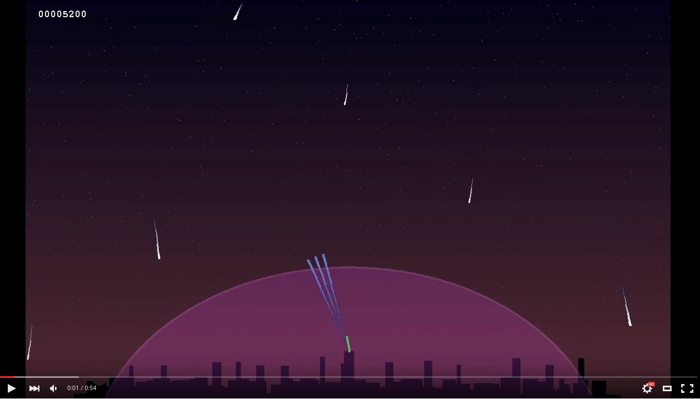

Missile Defence Game
====================

License: Apache2
-------------
Copyright 2011-2016 Ryan Lothian

Licensed under the Apache License, Version 2.0 (the "License");
you may not use this file except in compliance with the License.
You may obtain a copy of the License at

http://www.apache.org/licenses/LICENSE-2.0

Unless required by applicable law or agreed to in writing, software
distributed under the License is distributed on an "AS IS" BASIS,
WITHOUT WARRANTIES OR CONDITIONS OF ANY KIND, either express or implied.
See the License for the specific language governing permissions and
limitations under the License.
 
Prerequisites
--------------
Make sure you have python, pygame and numpy installed.
This program was tested with Python 2.7.

How to play
-----------

    $ python missile_defence.py

Use the mouse to aim and fire.

Keys:

* q   quit
* r   reset
* a   auto aiming and firing (e.g. for use as a screensaver)

 
Feedback
--------
Please e-mail github @ ryanlothian.com

Thanks!
